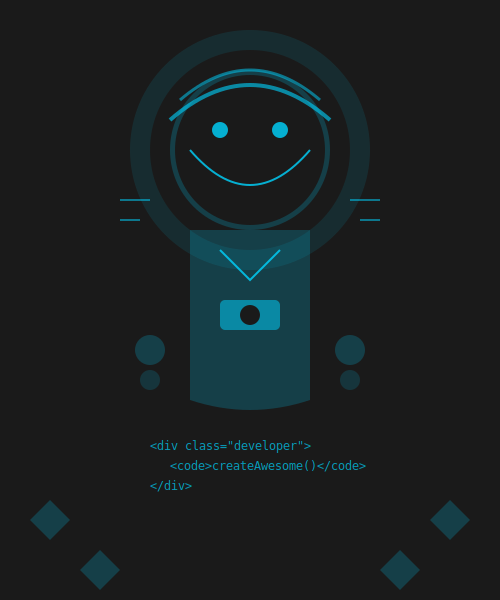

<<<<<<< HEAD
# portfolio
=======
# Modern Portfolio Website



A premium, responsive portfolio website with modern animations, dark/light mode, and interactive elements.

## Features

### Core Features
- **Responsive Design**: Fully responsive across all devices and screen sizes
- **Dark/Light Mode**: Toggle between themes with persistent user preference
- **Loading Animation**: Animated percentage counter (0-100%) with SVG transition
- **Interactive Navigation**: Smooth scrolling with active state indicators
- **Project Showcase**: Interactive project cards with flip animation
- **Statistics Section**: Animated counters and progress bars
- **Contact Form**: Validated contact form with success/error messages
- **Particle Background**: Interactive particle animation in the hero section

### Animations & Transitions
- **Loading Screen**: Percentage counter with SVG animation
- **Typewriter Effect**: Dynamic text animation in the hero section
- **Scroll Animations**: Fade-in and staggered reveal animations
- **Hover Effects**: Interactive hover states for buttons and cards
- **Theme Transition**: Smooth transition between dark and light modes
- **Custom Cursor**: Animated custom cursor (desktop only)
- **Ripple Effect**: Interactive ripple effect on clickable elements
- **Parallax Effect**: Subtle parallax scrolling for depth

## Setup Instructions

### Prerequisites
- A modern web browser (Chrome, Firefox, Safari, Edge)
- Basic knowledge of HTML, CSS, and JavaScript (for customization)

### Local Setup

1. **Clone or download the repository**
   ```
   git clone <repository-url>
   ```
   or download and extract the ZIP file

2. **Navigate to the project directory**
   ```
   cd portfolio-project
   ```

3. **Start a local development server**

   Using Python:
   ```
   python -m http.server 8000
   ```

   Using Node.js (if installed):
   ```
   npx http-server
   ```

4. **Open in your browser**
   - Navigate to `http://localhost:8000` or the URL shown in your terminal

## Project Structure

```
├── index.html              # Main HTML file
├── style.css               # Core styles
├── theme.css               # Dark/light mode styles
├── premium-animations.css  # Advanced animations
├── about-premium.css       # About section styles
├── statistics-premium.css  # Statistics section styles
├── script.js               # Core JavaScript functionality
├── premium-features.js     # Advanced features and animations
├── assets/                 # Images and project assets
│   ├── images/
│   └── projects/
└── README.md               # Project documentation
```

## Customization

### Changing Colors
- Edit the CSS variables in `style.css` and `theme.css`
- Main accent color is defined in `:root` as `--accent-color`

### Adding Projects
- Duplicate the project card structure in the Projects section of `index.html`
- Update images, titles, descriptions, and links

### Modifying Animations
- Speed and behavior of animations can be adjusted in `premium-animations.css`
- Loading screen timing can be modified in `premium-features.js`

## Browser Support

- Chrome (latest)
- Firefox (latest)
- Safari (latest)
- Edge (latest)

## Performance Optimization

- Optimized SVG graphics
- Efficient CSS animations using transforms and opacity
- Lazy loading for images
- Responsive image sizing

## License

This project is available for personal and commercial use.
>>>>>>> 614da12 (Initial commit: Portfolio website project)
